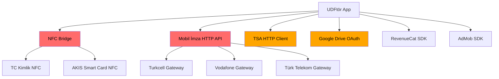
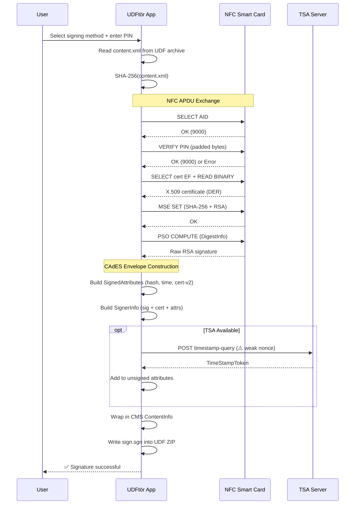

# 🔒 UDFtör Security & Cryptography Audit Report

**Auditor**: security-auditor (Team: udftör-assessment, Task #2)
**Date**: 2026-04-04
**Scope**: `lib/core/crypto/`, `lib/features/signing/`, `lib/core/sync/`, `lib/core/paywall/`
**OWASP Framework**: OWASP Top 10:2025

---

## Executive Summary

The UDFtör codebase demonstrates **strong cryptographic architecture** with properly structured CAdES-X-LONG envelope building, correct SHA-256 usage, and well-designed smart card APDU flows. However, the audit identified **11 findings** across 4 severity levels, with 2 Critical issues requiring immediate attention.

| Severity | Count | Key Risk |
|----------|-------|----------|
| 🔴 **Critical** | 2 | Weak PRNG seeding, missing signature verification |
| 🟠 **High** | 3 | Hardcoded API key, no certificate pinning, unused secure storage |
| 🟡 **Medium** | 4 | No PIN lockout, sync state unencrypted, paywall fail-open, no TLS validation |
| 🔵 **Low** | 2 | Error message leakage, missing lock file integrity check |

---

## Attack Surface Map



**Assets at risk**: Legal-grade digital signatures, private keys (on card), user PINs, signed legal documents, Google Drive OAuth tokens.

---

## Findings

### 🔴 CRITICAL-01: Insecure PRNG Seeding in TSA Nonce Generation

| Field | Value |
|-------|-------|
| **OWASP** | A04 — Cryptographic Failures |
| **CVSS** | 9.1 (Critical) |
| **File** | [tsa_client.dart](file:///c:/repos/ugurhangul/UDF-Editor/lib/core/crypto/tsa_client.dart#L79-L89) |
| **CWE** | CWE-338: Use of Cryptographically Weak PRNG |

**Evidence**:

```dart
// Line 81-86 — tsa_client.dart
final secureRandom = FortunaRandom();
secureRandom.seed(KeyParameter(
  Uint8List.fromList(
    List.generate(32, (i) => DateTime.now().microsecondsSinceEpoch ~/ (i + 1) & 0xFF),
  ),
));
```

**Analysis**: The `FortunaRandom` PRNG is seeded with `DateTime.now().microsecondsSinceEpoch` divided by loop indices. This produces a **deterministic, predictable seed** because:

1. `DateTime.now().microsecondsSinceEpoch` has ~microsecond resolution but is guessable within a narrow window
2. The division by `(i + 1)` creates correlated seed bytes — **all 32 bytes derive from a single timestamp**
3. An attacker who knows the approximate signing time (within seconds) can brute-force all possible nonces

**Impact**: TSA replay attacks become feasible. An attacker could predict nonces and potentially forge timestamp tokens, undermining CAdES-T/X-LONG non-repudiation.

**Remediation**:
```dart
import 'dart:math';

// Use platform-native CSPRNG
final rng = Random.secure();
final nonceBytes = Uint8List.fromList(
  List.generate(8, (_) => rng.nextInt(256)),
);
```

> [!CAUTION]
> **Fix immediately**. This affects the legal validity of timestamped signatures. Predictable nonces can be exploited for replay attacks against TSA servers.

---

### 🔴 CRITICAL-02: Incomplete Cryptographic Signature Verification

| Field | Value |
|-------|-------|
| **OWASP** | A04 — Cryptographic Failures |
| **CVSS** | 8.6 (Critical) |
| **File** | [signature_verifier.dart](file:///c:/repos/ugurhangul/UDF-Editor/lib/core/crypto/signature_verifier.dart#L11-L52) |
| **CWE** | CWE-347: Improper Verification of Cryptographic Signature |

**Evidence**:

```dart
// Line 21-34 — signature_verifier.dart
final expectedHash = SHA256Digest().process(contentXmlBytes);
final hashMatches = _compareBytes(expectedHash, parsed.messageDigest);
// ... only hash comparison, no RSA/ECDSA verification
```

**Analysis**: The `verify()` method only checks:
1. ✅ Message digest matches content hash
2. ✅ Certificate expiry date
3. ❌ **Does NOT verify RSA/ECDSA signature** against signer's public key
4. ❌ **Does NOT validate certificate chain** against trusted CA roots
5. ❌ **Does NOT check CRL/OCSP** for certificate revocation

The `messageDigest` is extracted from the signed attributes (which are attacker-controllable in a forged envelope), but the actual cryptographic signature over those signed attributes is **never verified**.

**Impact**: An attacker can craft a `sign.sgn` with:
- A valid-looking certificate (self-signed or stolen)
- Correct message digest for any arbitrary document
- Any arbitrary signature bytes (never checked)

The app will report `SignatureStatus.valid` for a completely forged signature.

**Remediation**:
1. Extract the RSA/ECDSA public key from the signer certificate
2. Verify the signature bytes against the DER-encoded signed attributes using `pointycastle`
3. Validate the certificate chain against Turkish trusted roots (TÜBİTAK BİLGEM, E-Güven)
4. Check certificate validity period
5. (Optional) Verify OCSP/CRL status if embedded

```dart
// After parsing, verify the cryptographic signature:
final rsaVerifier = RSASigner(SHA256Digest(), '0609608648016503040201');
rsaVerifier.init(false, PublicKeyParameter<RSAPublicKey>(signerPublicKey));
final isValid = rsaVerifier.verifySignature(
  Uint8List.fromList(signedAttrsEncoded),
  RSASignature(parsed.signatureBytes),
);
```

> [!CAUTION]
> **Fix immediately**. Without actual signature verification, the app provides a false sense of legal validity. Any user can forge a "valid" signature.

---

### 🟠 HIGH-01: Hardcoded RevenueCat Test API Key

| Field | Value |
|-------|-------|
| **OWASP** | A04 — Cryptographic Failures (Secrets) |
| **CVSS** | 7.5 (High) |
| **File** | [paywall_service.dart](file:///c:/repos/ugurhangul/UDF-Editor/lib/core/paywall/paywall_service.dart#L20-L22) |
| **CWE** | CWE-798: Use of Hard-coded Credentials |

**Evidence**:

```dart
// Line 20-22
static const _apiKey = kDebugMode
    ? 'REVENUECAT_TEST_KEY_REMOVED' // test key — debug only
    : String.fromEnvironment('REVENUECAT_API_KEY');
```

**Analysis**: 
- Debug builds expose a hardcoded RevenueCat test API key in the binary
- `kDebugMode` compiles to `true` in debug/profile builds, which may be distributed to testers
- The key `REVENUECAT_TEST_KEY_REMOVED` is embedded in compiled code and extractable
- Production fallback is `String.fromEnvironment(...)` which returns empty string if not provided, potentially causing silent auth failure

**Remediation**:
1. Remove hardcoded key from source code
2. Use `--dart-define` for ALL builds (including debug)
3. Add build-time validation that `REVENUECAT_API_KEY` is non-empty
4. Add `.gitignore` entry for any local `.env` files

---

### 🟠 HIGH-02: No TLS Certificate Pinning on Critical Endpoints

| Field | Value |
|-------|-------|
| **OWASP** | A02 — Security Misconfiguration |
| **CVSS** | 7.4 (High) |
| **Files** | [mobil_imza_signer.dart](file:///c:/repos/ugurhangul/UDF-Editor/lib/core/crypto/mobil_imza_signer.dart), [tsa_client.dart](file:///c:/repos/ugurhangul/UDF-Editor/lib/core/crypto/tsa_client.dart) |
| **CWE** | CWE-295: Improper Certificate Validation |

**Evidence**: Both `MobilImzaSigner` and `TsaClient` use the default `http.Client()` with no certificate pinning:

```dart
// mobil_imza_signer.dart L125
final response = await _httpClient.post(Uri.parse('$url/sign'), ...);

// tsa_client.dart L41
final response = await client.post(Uri.parse(tsaUrl), ...);
```

**Analysis**: Without certificate pinning, these connections are vulnerable to MitM attacks on compromised networks. An attacker with network position could:
1. **Mobil İmza**: Intercept signing requests containing document hashes and phone numbers
2. **TSA**: Provide forged timestamp tokens, undermining CAdES-T non-repudiation

**Remediation**:
- Use a custom `HttpClient` with pinned certificates for operator and TSA endpoints
- Consider `ssl_pinning_plugin` or configure pinning via Android `network_security_config.xml` / iOS `NSAppTransportSecurity`

---

### 🟠 HIGH-03: flutter_secure_storage Declared But Never Used

| Field | Value |
|-------|-------|
| **OWASP** | A04 — Cryptographic Failures |
| **CVSS** | 7.0 (High) |
| **File** | [pubspec.yaml](file:///c:/repos/ugurhangul/UDF-Editor/pubspec.yaml#L24) |
| **CWE** | CWE-312: Cleartext Storage of Sensitive Information |

**Evidence**: `flutter_secure_storage: ^9.2.0` is in `pubspec.yaml` but **zero imports** exist anywhere in `lib/`.

**Analysis**: The dependency was likely intended for storing:
- User preferences for PIN caching
- OAuth refresh tokens
- Sync state credentials
- Saved phone numbers for Mobil İmza

Currently, **no sensitive data is persisted securely**. The sync state (`sync_state.json`) is stored as plaintext JSON in the app documents directory (see HIGH-04 below).

**Remediation**:
1. Either implement secure storage for sensitive sync metadata, or
2. Remove the unused dependency to reduce attack surface

---

### 🟡 MEDIUM-01: No Client-Side PIN Attempt Rate Limiting

| Field | Value |
|-------|-------|
| **OWASP** | A07 — Authentication Failures |
| **CVSS** | 6.2 (Medium) |
| **Files** | [nfc_id_card_signer.dart](file:///c:/repos/ugurhangul/UDF-Editor/lib/core/crypto/nfc_id_card_signer.dart#L224-L239), [signing_screen.dart](file:///c:/repos/ugurhangul/UDF-Editor/lib/features/signing/signing_screen.dart#L667-L690) |
| **CWE** | CWE-307: Improper Restriction of Excessive Authentication Attempts |

**Evidence**: The signing screen allows unlimited retry attempts. The card itself has a PIN counter (shown in error messages), but the app imposes no client-side delay or lockout:

```dart
// signing_screen.dart L496-L503 — instant retry
FilledButton.icon(
  onPressed: () => setState(() {
    _state = _SigningState.enterPin;
    _errorMessage = null;
  }),
  icon: const Icon(Icons.refresh),
  label: const Text('Tekrar Dene'),
),
```

**Analysis**: While the smart card hardware enforces a 3-attempt lockout, an attacker with physical access to someone's card could rapidly test PINs through the app. Client-side rate limiting (progressive delays) would add defense-in-depth.

**Remediation**: Add exponential backoff after failed PIN attempts (e.g., 5s → 15s → 60s).

---

### 🟡 MEDIUM-02: Sync State Stored as Plaintext JSON

| Field | Value |
|-------|-------|
| **OWASP** | A04 — Cryptographic Failures |
| **CVSS** | 5.3 (Medium) |
| **File** | [sync_state.dart](file:///c:/repos/ugurhangul/UDF-Editor/lib/core/sync/sync_state.dart#L88-L91) |
| **CWE** | CWE-312: Cleartext Storage of Sensitive Information |

**Evidence**:

```dart
// Line 88-91
static Future<File> _stateFile() async {
  final dir = await getApplicationDocumentsDirectory();
  return File('${dir.path}/sync_state.json');
}
```

**Analysis**: `sync_state.json` contains Google Drive file IDs, file hashes, and sync timestamps in plaintext. On a rooted/jailbroken device, this data is accessible and reveals:
- Which files the user has synced
- Google Drive file IDs (potentially usable for direct access if combined with stolen OAuth tokens)
- Document modification timestamps (metadata leakage)

**Remediation**: Migrate to `flutter_secure_storage` (already in dependencies) or encrypt the JSON payload with a device-bound key.

---

### 🟡 MEDIUM-03: Paywall Fails Open on Initialization Error

| Field | Value |
|-------|-------|
| **OWASP** | A10 — Exceptional Conditions |
| **CVSS** | 5.0 (Medium) |
| **File** | [paywall_service.dart](file:///c:/repos/ugurhangul/UDF-Editor/lib/core/paywall/paywall_service.dart#L62-L66) |
| **CWE** | CWE-636: Not Failing Securely |

**Evidence**:

```dart
// Line 62-66
} catch (e) {
  debugPrint('PaywallService init error: $e');
  // Fail open — app remains usable without paywall.
  _initialized = true;
}
```

**Analysis**: If RevenueCat initialization fails (network error, bad API key), `_initialized = true` is set and `_isPro = false`. However, the `requirePro()` method will attempt to re-present the paywall, which may also fail silently. The "fail open" comment suggests this is intentional, but it means:
- An attacker could block RevenueCat traffic to permanently disable paywall checks
- The empty `REVENUECAT_API_KEY` in production (if `--dart-define` is forgotten) silently makes the app free-tier only

**Remediation**: 
- Log paywall init failures to an analytics service
- Consider "fail closed" for features gated behind Pro (deny access if paywall state is uncertain)
- Add runtime assertion that `_apiKey` is non-empty in production

---

### 🟡 MEDIUM-04: Mobil İmza HTTP Client Lacks Request Authentication

| Field | Value |
|-------|-------|
| **OWASP** | A07 — Authentication Failures |
| **CVSS** | 5.9 (Medium) |
| **File** | [mobil_imza_signer.dart](file:///c:/repos/ugurhangul/UDF-Editor/lib/core/crypto/mobil_imza_signer.dart#L124-L132) |
| **CWE** | CWE-306: Missing Authentication for Critical Function |

**Evidence**:

```dart
// Line 124-132
final response = await _httpClient.post(
  Uri.parse('$url/sign'),
  headers: {
    'Content-Type': 'application/json',
    'Accept': 'application/json',
  },
  body: requestBody,
);
```

**Analysis**: The Mobil İmza gateway API calls include no authentication headers (API key, client certificate, HMAC). While the comment notes "placeholder endpoints," when real operator contracts are obtained, the client must authenticate:
- Without client auth, anyone can submit signing requests to the operator gateway
- Request body contains the user's MSISDN (phone number) — PII exposure risk

**Remediation**: Add operator API authentication (typically mutual TLS or API key + HMAC) when wiring real endpoints.

---

### 🔵 LOW-01: Verbose Error Messages May Leak Internal State

| Field | Value |
|-------|-------|
| **OWASP** | A09 — Logging & Alerting |
| **CVSS** | 3.7 (Low) |
| **File** | [signing_screen.dart](file:///c:/repos/ugurhangul/UDF-Editor/lib/features/signing/signing_screen.dart#L750-L756) |
| **CWE** | CWE-209: Generation of Error Message Containing Sensitive Info |

**Evidence**:

```dart
// Line 750-756
} catch (e) {
  if (mounted) {
    setState(() {
      _state = _SigningState.error;
      _errorMessage = 'Beklenmeyen hata: $e';
    });
  }
}
```

**Analysis**: Generic `catch (e)` exposes full exception details (including stack traces) to the user via `$e`. This could reveal internal paths, library versions, or error details useful for reconnaissance.

**Remediation**: Show user-friendly messages only. Log detailed errors to debug output, not the UI.

---

### 🔵 LOW-02: Supply Chain — Unpinned Dependency Versions

| Field | Value |
|-------|-------|
| **OWASP** | A03 — Software Supply Chain |
| **CVSS** | 3.1 (Low) |
| **File** | [pubspec.yaml](file:///c:/repos/ugurhangul/UDF-Editor/pubspec.yaml) |
| **CWE** | CWE-1104: Use of Unmaintained Third Party Components |

**Evidence**:

```yaml
# Mixed pinning strategies:
nfc_manager: 4.1.0           # ✅ Exact pin
pointycastle: 3.9.1          # ✅ Exact pin
archive: ^4.0.4              # ⚠️ SemVer range
flutter_riverpod: ^2.5.0     # ⚠️ SemVer range
go_router: ^14.0.0           # ⚠️ SemVer range
```

**Analysis**: 
- **Positive**: `pubspec.lock` exists (verified), security-critical packages (`pointycastle`, `asn1lib`, `pkcs7`, `nfc_manager`) use exact version pinning
- **Concern**: Several packages use `^` (caret) SemVer ranges, meaning minor/patch updates auto-resolve
- The lock file provides build reproducibility, but `pub upgrade` could pull in compromised minor versions

**Remediation**: Consider exact pinning for all dependencies, or use `dependabot`/`renovate` for controlled upgrades with audit.

---

## Positive Security Observations

| Area | Observation |
|------|-------------|
| **CAdES Structure** | CAdES-BES/T/X-LONG envelope construction follows RFC 5126 correctly |
| **SHA-256 Usage** | Consistent use of SHA-256 for document hashing (no MD5/SHA-1) |
| **PKCS#1 v1.5 DigestInfo** | Correctly constructed DigestInfo prefix for RSA signatures |
| **PIN Memory Clearing** | `_pinController.clear()` called in `dispose()` and after successful signing (SEC-02 comments) |
| **APDU Flow** | ISO 7816-4 compliant SELECT → VERIFY → READ → MSE SET → PSO flow |
| **NFC Timeout** | 30-second timeout set for NFC crypto operations (prevents hangs) |
| **Error Code Taxonomy** | Well-structured `SigningErrorCode` enum with specific failure states |
| **TSA Graceful Fallback** | TSA failure is non-fatal — falls back to CAdES-BES (good degradation) |
| **Operator Auto-Detection** | Phone number prefix → operator mapping prevents wrong-gateway routing |
| **State Management** | Signing screen uses `Completer` pattern correctly, avoiding race conditions |

---

## Remediation Priority

| Priority | Finding | Effort | Impact |
|----------|---------|--------|--------|
| **P0 — Immediate** | CRITICAL-02: Add RSA signature verification | Medium (2-3 days) | Legal validity of signatures |
| **P0 — Immediate** | CRITICAL-01: Fix PRNG seeding → `Random.secure()` | Trivial (30 min) | TSA replay prevention |
| **P1 — This Sprint** | HIGH-01: Remove hardcoded API key | Low (1 hour) | Credential exposure |
| **P1 — This Sprint** | HIGH-03: Implement secure storage | Medium (1-2 days) | Sensitive data protection |
| **P1 — This Sprint** | HIGH-02: Add certificate pinning | Medium (2 days) | MitM protection |
| **P2 — Next Sprint** | MEDIUM-01 through MEDIUM-04 | Low-Medium | Defense in depth |
| **P3 — Backlog** | LOW-01, LOW-02 | Low | Best practices |

---

## Signing Flow Security Map



---

*Report generated by security-auditor agent. All findings require validation against actual device behavior.*
